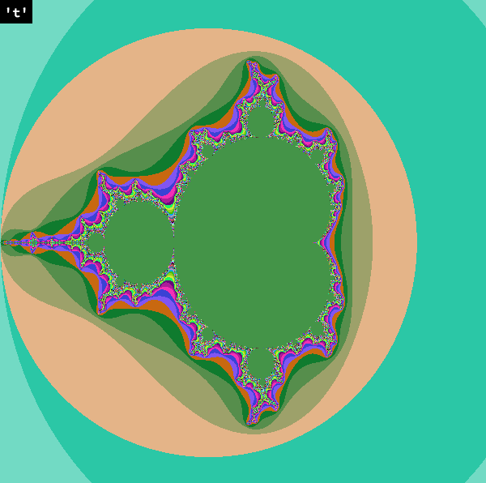
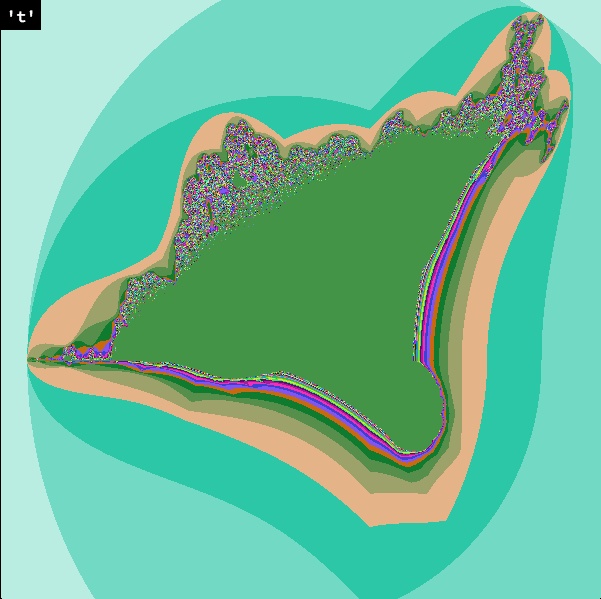
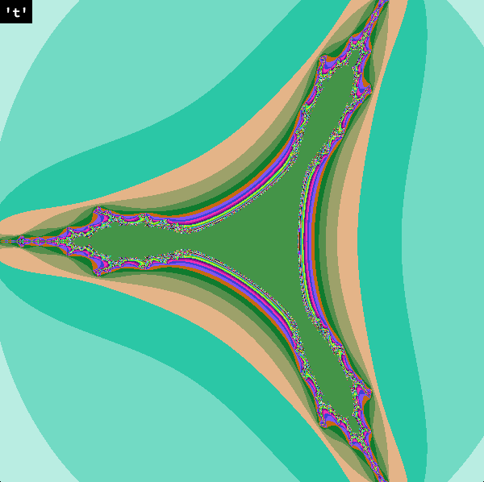
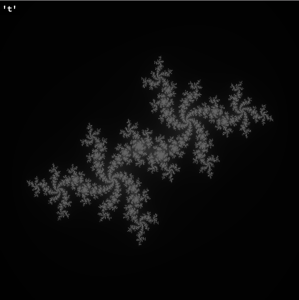
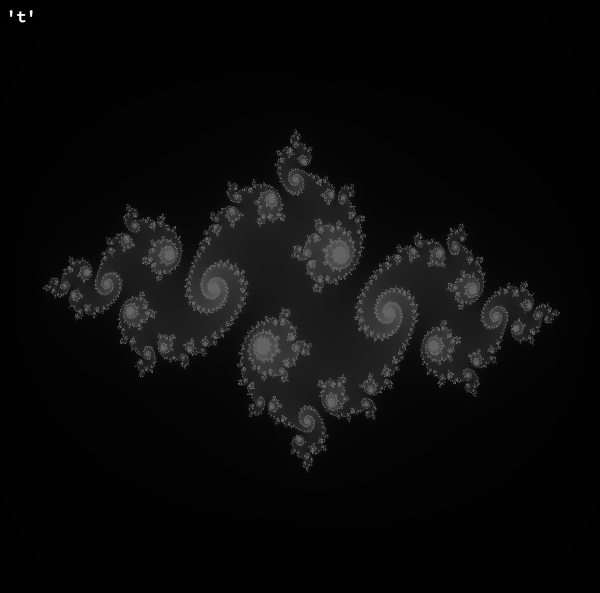
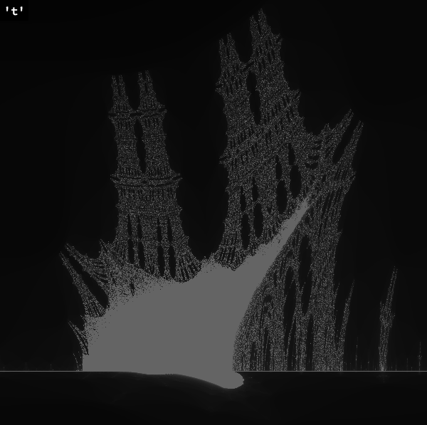
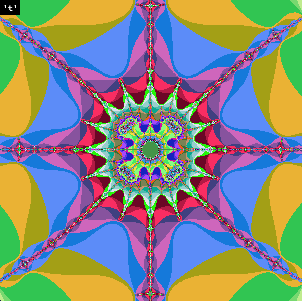
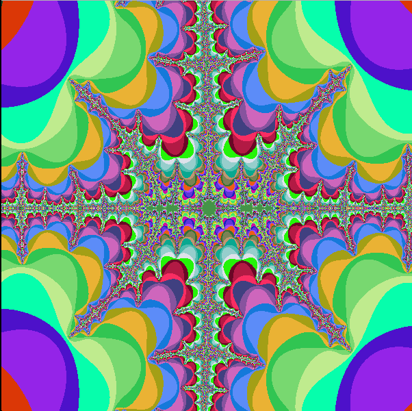

# fractol (MACOSX)
Second graphics project at 42. Rendering and exploring different kinds of fractals.

To build: ```make```

Usage: ```./fractol [mandelbrot | julia | burningship | tricorn]```

















